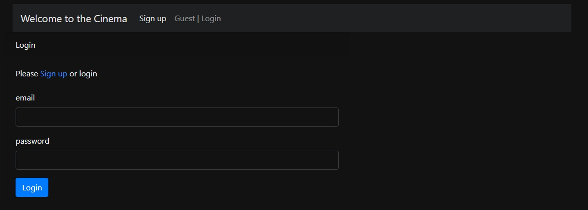
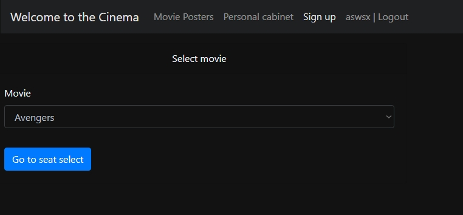
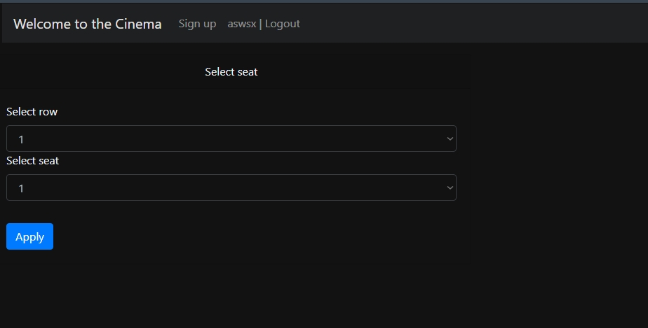
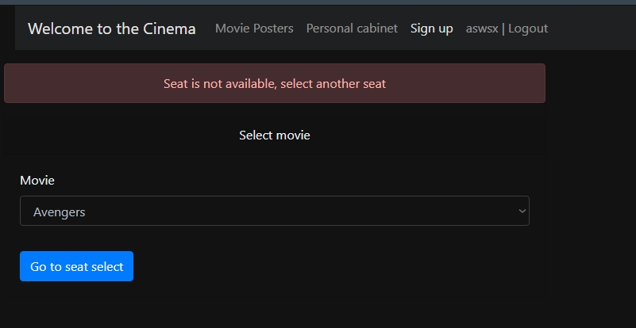
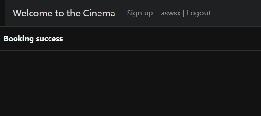
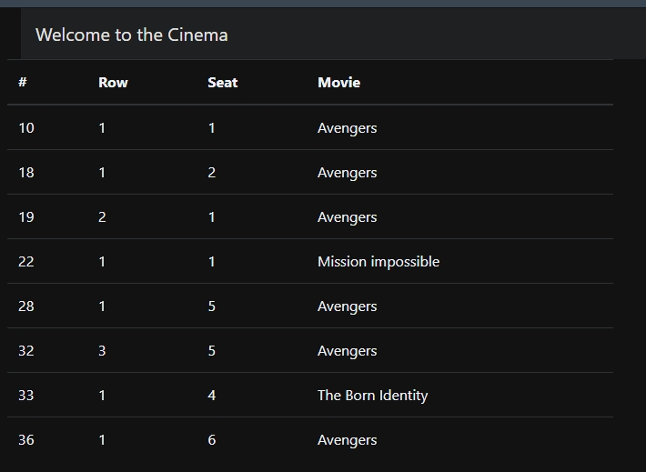
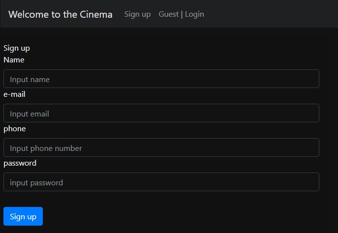
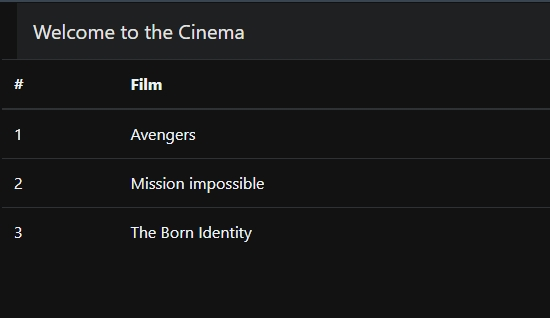

# job4j_cinema

## Навыки

Проект сайта бронирования билетов в кинотеатр

При входе на сайт, если пользователь не залогинился, он попадает на страницу входа. На этой же странице доступна кнопка 
перехода на страницу регистрации нового пользователя
  

После входа на сайт пользователь попадает на страницу выбора фильма
  

Со страницы выбора фильма осуществляется переход на страницу выбора ряда и места и подтверждения покупки билета
  

Если пользователь пытается купить уже купленный билет, осуществляется переход на данную страницу
  

Если же билет куплен успешно, переход на эту страницу
   

На сайте есть кабинет пользователя, в котором находится список купленных пользователем билетов
  

Страница регистрации нового пользователя
  

Страница-афиша всех доступных фильмов
  
  
